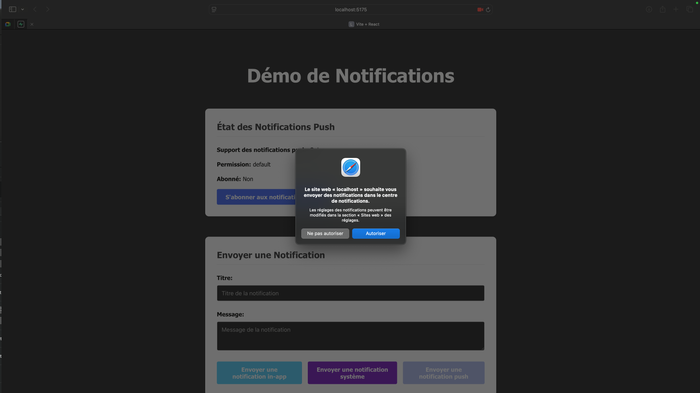
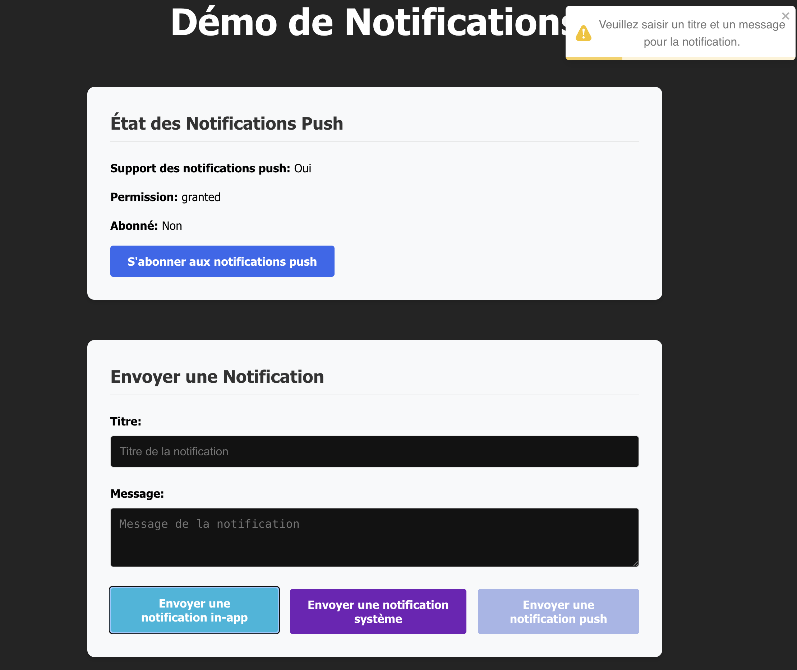
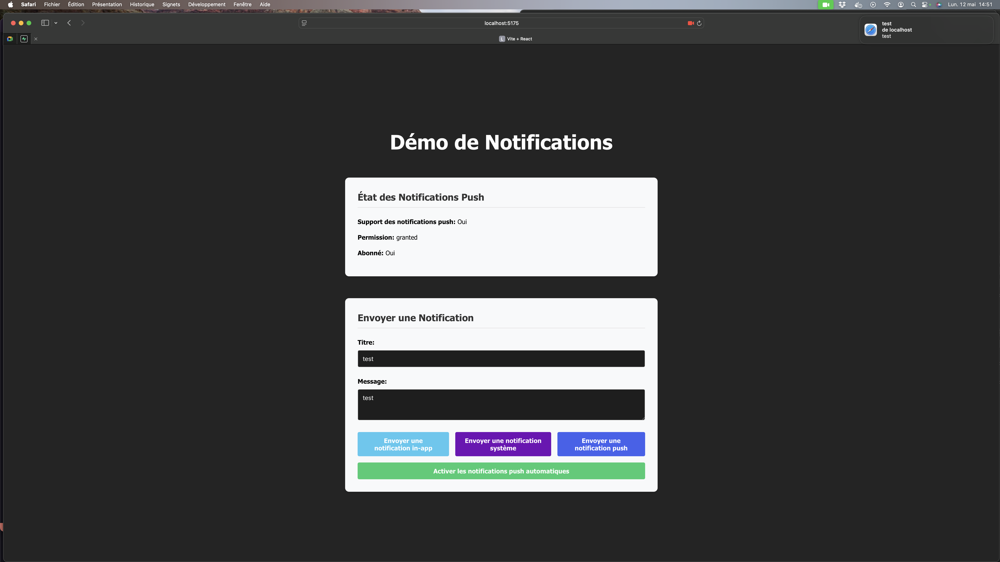
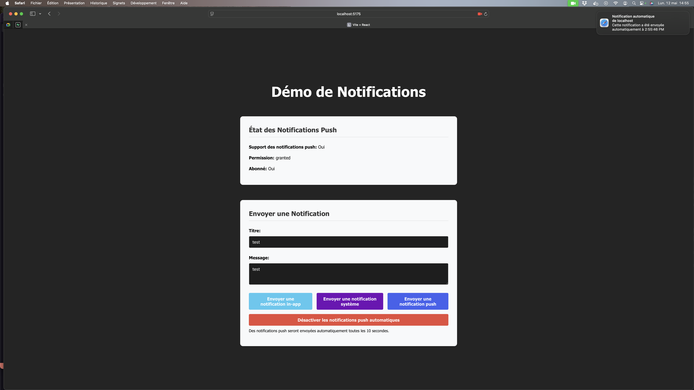

# Démo de Notifications In-App et Push

Cette application de démonstration montre comment implémenter des notifications in-app et des notifications push dans une application React avec Vite. Elle utilise un serveur Express pour gérer les notifications push.

## Fonctionnalités

Cette démo prend en charge trois types de notifications :

1. **Notifications in-app** : Affichées uniquement à l'intérieur de l'application via react-toastify (toasts)
2. **Notifications système** : Notifications natives du système d'exploitation, affichées via l'API Notification du navigateur
3. **Notifications push** : Notifications qui peuvent être reçues même lorsque l'application est fermée, via un service worker et l'API Web Push

Autres fonctionnalités :
- Service worker pour gérer les notifications push en arrière-plan
- Serveur Express pour gérer les abonnements et l'envoi des notifications push
- Interface utilisateur intuitive pour tester les différents types de notifications

## Schéma explicatif des systèmes de notifications

```
+------------------+     +-----------------+     +--------------------+
|                  |     |                 |     |                    |
| NOTIFICATIONS    |     | NOTIFICATIONS   |     | NOTIFICATIONS      |
| IN-APP (TOASTS)  |     | SYSTÈME        |     | PUSH              |
|                  |     |                 |     |                    |
+------------------+     +-----------------+     +--------------------+
        |                        |                         |
        v                        v                         v
+------------------+     +-----------------+     +--------------------+
| React + Toastify |     | API Notification|     | Service Worker     |
| (dans le DOM)    |     | du navigateur   |     | + API Web Push     |
+------------------+     +-----------------+     +--------------------+
        |                        |                         |
        v                        v                         v
+------------------+     +-----------------+     +--------------------+
| Visibles         |     | Visibles hors   |     | Visibles même si  |
| uniquement dans  |     | de l'application|     | l'application est  |
| l'application    |     | mais navigateur |     | fermée            |
| ouverte          |     | doit être ouvert|     |                    |
+------------------+     +-----------------+     +--------------------+
                                                           |
                                                           v
                                                 +--------------------+
                                                 | Serveur Express    |
                                                 | (gère abonnements  |
                                                 | et envoi)          |
                                                 +--------------------+
```

### Flux des notifications push

1. **Abonnement** : L'utilisateur s'abonne aux notifications push via l'API Web Push
2. **Stockage** : Le serveur stocke l'abonnement (endpoint, clés, etc.)
3. **Envoi** : Le serveur envoie une notification via le service de push du navigateur
4. **Réception** : Le service worker reçoit la notification et l'affiche, même si l'application est fermée

### Comparaison des types de notifications

| Type          | Visibilité                    | Technologie                | Persistance             |
|---------------|--------------------------------|----------------------------|-------------------------|
| In-App        | Dans l'application uniquement  | React + Toastify           | Disparaissent après un délai |
| Système       | Hors application, navigateur ouvert | API Notification         | Restent jusqu'à interaction |
| Push          | Même avec application fermée   | Service Worker + Web Push  | Restent dans le centre de notifications |

## Prérequis

- Node.js (version 14 ou supérieure)
- npm ou yarn

## Installation

1. Installez les dépendances de l'application React :

```bash
npm install
```

2. Installez les dépendances du serveur Express :

```bash
cd server
npm install
cd ..
```

## Démarrage

1. Démarrez le serveur Express :

```bash
cd server
npm start
```

Le serveur démarrera sur le port 5001. Vous verrez les clés VAPID générées dans la console.

2. Dans un autre terminal, démarrez l'application React :

```bash
npm run dev
```

L'application démarrera sur http://localhost:5173.

## Utilisation

1. Ouvrez l'application dans votre navigateur
2. Cliquez sur "S'abonner aux notifications push" pour autoriser les notifications push
3. Saisissez un titre et un message pour la notification
4. Testez les différents types de notifications :
   - **Notification in-app** : Affiche un toast à l'intérieur de l'application
   - **Notification système** : Affiche une notification native du système d'exploitation
   - **Notification push** : Envoie une notification qui s'affichera même lorsque l'application n'est pas au premier plan ou est fermée

## Notifications Push "Offline" comme les Applications Natives

Cette démo implémente un système de notifications push qui fonctionne de manière similaire aux applications natives :

- **Réception hors ligne** : Les notifications peuvent être reçues même lorsque l'utilisateur n'est pas sur le site web
- **Fonctionnement en arrière-plan** : Grâce au service worker, les notifications sont traitées même lorsque l'application est fermée
- **Persistance** : Les abonnements sont stockés côté serveur, permettant d'envoyer des notifications à tout moment
- **Notifications automatiques** : Démonstration de notifications envoyées à intervalles réguliers sans intervention de l'utilisateur

Cela est possible grâce à :

1. **Service Worker** : Exécute du code en arrière-plan, indépendamment de l'application
2. **Web Push API** : Permet l'envoi de notifications aux utilisateurs abonnés
3. **Système d'abonnement** : Gère les endpoints de notification pour chaque utilisateur

## Captures d'écran

### Interface de l'application



### Types de notifications

#### Notification in-app (toast)



#### Notification système



#### Notification push



## Services dédiés pour les notifications push

Bien que cette démo implémente les notifications push avec un serveur Express personnalisé, il existe plusieurs services tiers spécialisés qui facilitent l'implémentation des notifications push à grande échelle :

### Services populaires

- **[OneSignal](https://onesignal.com/)** : Plateforme complète de notification push, des analyses détaillées et une interface utilisateur conviviale.

- **[Pusher](https://pusher.com/)** : Service de communication en temps réel qui inclut les notifications push parmi ses fonctionnalités.

- **[Pushwoosh](https://www.pushwoosh.com/)** : Solution de notification push multi-plateforme avec des fonctionnalités de segmentation avancées.

### Avantages des services dédiés

- **Évolutivité** : Gestion de millions de notifications sans infrastructure complexe
- **Fiabilité** : Taux de livraison élevé grâce à l'optimisation des canaux de livraison
- **Analyses** : Suivi détaillé des taux d'ouverture et d'engagement
- **Segmentation** : Ciblage précis des utilisateurs selon divers critères
- **Programmation** : Planification des notifications à des moments optimaux

## Notes

- Les notifications push ne fonctionnent que dans les navigateurs modernes qui prennent en charge l'API Web Push
- Les notifications push ne fonctionnent qu'en HTTPS, sauf sur localhost pour le développement
- Pour un déploiement en production, vous devrez générer des clés VAPID persistantes et les stocker de manière sécurisée
