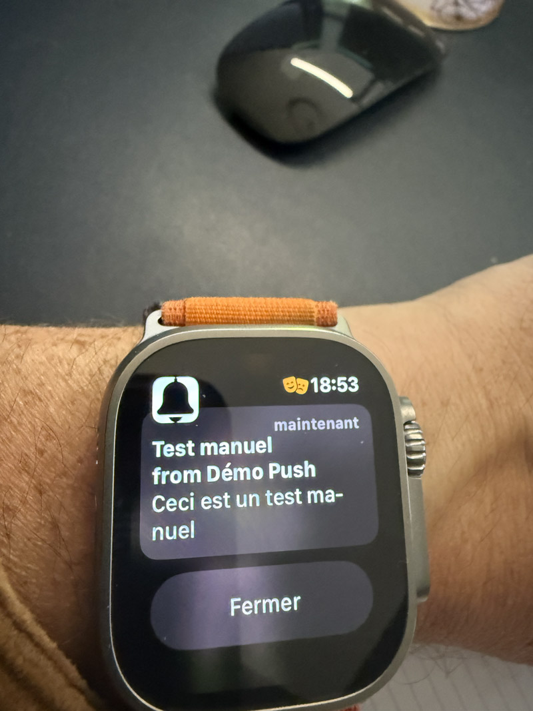

# Démo de Notifications In-App et Push

Cette application de démonstration montre comment implémenter des notifications in-app et des notifications push dans une application React avec Vite. Elle utilise un serveur Express pour gérer les notifications push.

## Fonctionnalités

Cette démo prend en charge trois types de notifications :

1. **Notifications in-app** : affichées uniquement à l'intérieur de l'application via react-toastify (toasts)
2. **Notifications système** : notifications natives du système d'exploitation, affichées via l'API Notification du navigateur
3. **Notifications push** : notifications qui peuvent être reçues même lorsque l'application est fermée, via un service worker et l'API Web Push

Autres fonctionnalités :
- service worker pour gérer les notifications push en arrière-plan
- serveur Express pour gérer les abonnements et l'envoi des notifications push
- interface utilisateur intuitive pour tester les différents types de notifications

## Schéma explicatif des systèmes de notifications

```
+------------------+     +-----------------+     +--------------------+
|                  |     |                 |     |                    |
| NOTIFICATIONS    |     | NOTIFICATIONS   |     | NOTIFICATIONS      |
| IN-APP (TOASTS)  |     | SYSTÈME        |     | PUSH              |
|                  |     |                 |     |                    |
+------------------+     +-----------------+     +--------------------+
        |                        |                         |
        v                        v                         v
+------------------+     +-----------------+     +--------------------+
| React + Toastify |     | API Notification|     | Service Worker     |
| (dans le DOM)    |     | du navigateur   |     | + API Web Push     |
+------------------+     +-----------------+     +--------------------+
        |                        |                         |
        v                        v                         v
+------------------+     +-----------------+     +--------------------+
| Visibles         |     | Visibles hors   |     | Visibles même si  |
| uniquement dans  |     | de l'application|     | l'application est  |
| l'application    |     | mais navigateur |     | fermée            |
| ouverte          |     | doit être ouvert|     |                    |
+------------------+     +-----------------+     +--------------------+
                                                           |
                                                           v
                                                 +--------------------+
                                                 | Serveur Express    |
                                                 | (gère abonnements  |
                                                 | et envoi)          |
                                                 +--------------------+
```

### Flux des notifications push

1. **Abonnement** : l'utilisateur s'abonne aux notifications push via l'API Web Push
2. **Stockage** : le serveur stocke l'abonnement (endpoint, clés, etc.)
3. **Envoi** : le serveur envoie une notification via le service de push du navigateur
4. **Réception** : le service worker reçoit la notification et l'affiche, même si l'application est fermée

## Cycle de vie complet d'une notification push

```
+----------------+     +----------------+     +----------------+     +----------------+
|                |     |                |     |                |     |                |
| 1. ABONNEMENT  | --> | 2. ENVOI       | --> | 3. RÉCEPTION   | --> | 4. AFFICHAGE   |
| (PushManager)  |     | (Serveur)      |     | (ServiceWorker)|     | (Notification) |
|                |     |                |     |                |     |                |
+----------------+     +----------------+     +----------------+     +----------------+
                                                                            |
                                                                            v
                                                                     +----------------+
                                                                     |                |
                                                                     | 5. INTERACTION |
                                                                     | (Clic)         |
                                                                     |                |
                                                                     +----------------+
```

### 1. Prérequis : Consentement de l'utilisateur

- **Demande de permission** : L'utilisateur doit explicitement accepter de recevoir des notifications
- **États possibles** : `granted` (accepté), `denied` (refusé), `default` (non décidé, équivalent à un refus)
- **Persistance** : Le choix est mémorisé par le navigateur pour les futures visites
- **Sans ce consentement** : Aucune notification push ne peut être envoyée ou reçue

### 2. Abonnement (PushManager)

- L'utilisateur donne son autorisation pour recevoir des notifications
- Le navigateur génère une paire de clés unique pour cet utilisateur
- PushManager crée un abonnement avec un endpoint spécifique au navigateur
- L'abonnement est envoyé au serveur et stocké pour une utilisation future

### 3. Envoi (Serveur)

- Le serveur décide d'envoyer une notification (manuellement ou automatiquement)
- Il récupère les informations d'abonnement de l'utilisateur
- Il chiffre le message avec la clé publique de l'utilisateur et les clés VAPID
- Il envoie le message chiffré au service de push du navigateur via l'endpoint

### 4. Réception (Service Worker)

- Le service de push du navigateur reçoit le message et réveille le Service Worker
- Le Service Worker intercepte l'événement 'push', même si l'application est fermée
- Il déchiffre le message avec la clé privée stockée localement
- Il prépare les données pour la notification

### 5. Affichage (Notification)

- Le Service Worker utilise l'API Notification pour afficher la notification
- La notification apparaît dans le système d'exploitation de l'utilisateur
- Elle reste visible jusqu'à ce que l'utilisateur interagisse avec elle ou la ferme

### 6. Interaction (Clic)

- L'utilisateur clique sur la notification
- Le Service Worker intercepte l'événement 'notificationclick'
- Il peut alors ouvrir l'application, naviguer vers une page spécifique ou exécuter une action
- La notification est fermée après l'interaction

### Comparaison des types de notifications

| Type          | Visibilité                    | Technologie                | Persistance             |
|---------------|--------------------------------|----------------------------|-------------------------|
| In-App        | Dans l'application uniquement  | React + Toastify           | Disparaissent après un délai |
| Système       | Hors application, navigateur ouvert | API Notification         | Restent jusqu'à interaction |
| Push          | Même avec application fermée   | Service Worker + Web Push  | Restent dans le centre de notifications |

## Prérequis

- Node.js (version 14 ou supérieure)
- npm ou yarn

## Installation

1. Installez les dépendances de l'application React :

```bash
npm install
```

2. Installez les dépendances du serveur Express :

```bash
cd server
npm install
cd ..
```

## Démarrage

1. Démarrez le serveur Express :

```bash
cd server
npm start
```

Le serveur démarrera sur le port 5001. Vous verrez les clés VAPID générées dans la console.

2. Dans un autre terminal, démarrez l'application React :

```bash
npm run dev
```

L'application démarrera sur http://localhost:5173.

## Utilisation

1. Ouvrez l'application dans votre navigateur
2. Cliquez sur "S'abonner aux notifications push" pour autoriser les notifications push
3. Saisissez un titre et un message pour la notification
4. Testez les différents types de notifications :
   - **Notification in-app** : affiche un toast à l'intérieur de l'application
   - **Notification système** : affiche une notification native du système d'exploitation
   - **Notification push** : envoie une notification qui s'affichera même lorsque l'application n'est pas au premier plan ou est fermée

## Notifications Push "Offline" comme les Applications Natives

Cette démo implémente un système de notifications push qui fonctionne de manière similaire aux applications natives :

- **Réception hors ligne** : les notifications peuvent être reçues même lorsque l'utilisateur n'est pas sur le site web
- **Fonctionnement en arrière-plan** : grâce au service worker, les notifications sont traitées même lorsque l'application est fermée
- **Persistance** : les abonnements sont stockés côté serveur, permettant d'envoyer des notifications à tout moment
- **Notifications automatiques** : Démonstration de notifications envoyées à intervalles réguliers sans intervention de l'utilisateur

Cela est possible grâce à :

1. **Service Worker** : Exécute du code en arrière-plan, indépendamment de l'application
2. **Web Push API** : Permet l'envoi de notifications aux utilisateurs abonnés
3. **Système d'abonnement** : Gère les endpoints de notification pour chaque utilisateur

## Captures d'écran

### Interface de l'application


### Types de notifications

#### Notification in-app (toast)


#### Notification système


#### Notification push




### Démonstration vidéo

Une démonstration vidéo de l'application est disponible sur Cloudinary. Pour la visualiser, accédez à la collection suivante :

[Voir la démonstration vidéo sur Cloudinary](https://collection.cloudinary.com/dx65nxpkq/528c73ace0f851050dbeae34ca132347)


## Clés VAPID et sécurité des notifications push

Les notifications push utilisent le protocole VAPID (Voluntary Application Server Identification) pour sécuriser la communication entre le serveur d'application et les services de notification des navigateurs.

### Qu'est-ce que VAPID ?

VAPID est un standard qui permet :

1. **Authentification du serveur** : Les clés VAPID permettent d'identifier de manière unique votre serveur auprès des services de push des navigateurs (Firefox, Chrome, Edge, etc.)

2. **Sécurité accrue** : Elles empêchent les tiers non autorisés d'envoyer des notifications à vos utilisateurs

3. **Conformité aux standards** : Elles sont requises par les navigateurs modernes pour utiliser l'API Web Push

### Comment fonctionnent les clés VAPID ?

- **Clé publique** : Envoyée au navigateur de l'utilisateur lors de l'abonnement aux notifications
- **Clé privée** : Conservée uniquement sur le serveur et utilisée pour signer les requêtes de notification

### Génération des clés VAPID

Dans cette démo, les clés VAPID sont générées avec la bibliothèque `web-push` :

```javascript
// Générer des clés VAPID
const vapidKeys = webpush.generateVAPIDKeys();

console.log('Public Key:', vapidKeys.publicKey);
console.log('Private Key:', vapidKeys.privateKey);
```

### Sécurité et bonnes pratiques

- **Ne jamais partager la clé privée** : Elle doit rester confidentielle et sécurisée
- **Utiliser des clés fixes** : Dans un environnement de production, utilisez toujours les mêmes clés pour maintenir la validité des abonnements
- **Stockage sécurisé** : Stockez les clés dans des variables d'environnement ou un système de gestion de secrets

## Services dédiés pour les notifications push

Bien que cette démo implémente les notifications push avec un serveur Express personnalisé, il existe plusieurs services tiers spécialisés qui facilitent l'implémentation des notifications push à grande échelle :

### Services populaires

- **[OneSignal](https://onesignal.com/)** : plateforme complète de notification push, des analyses détaillées et une interface utilisateur conviviale.

- **[Pusher](https://pusher.com/)** : service de communication en temps réel qui inclut les notifications push parmi ses fonctionnalités.

- **[Pushwoosh](https://www.pushwoosh.com/)** : solution de notification push multi-plateforme avec des fonctionnalités de segmentation avancées.

### Avantages des services dédiés

- **Évolutivité** : gestion de millions de notifications sans infrastructure complexe
- **Fiabilité** : taux de livraison élevé grâce à l'optimisation des canaux de livraison
- **Analyses** : suivi détaillé des taux d'ouverture et d'engagement
- **Segmentation** : ciblage précis des utilisateurs selon divers critères
- **Programmation** : planification des notifications à des moments optimaux

## Notes

- Les notifications push ne fonctionnent que dans les navigateurs modernes qui prennent en charge l'API Web Push
- Les notifications push ne fonctionnent qu'en HTTPS, sauf sur localhost pour le développement
- Pour un déploiement en production, vous devrez générer des clés VAPID persistantes et les stocker de manière sécurisée
